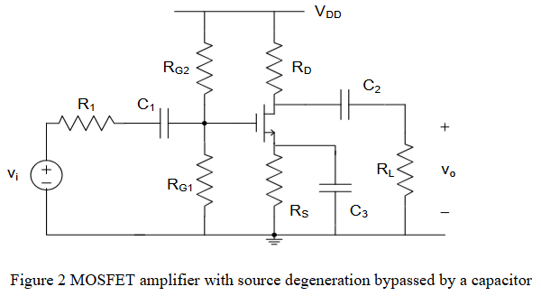
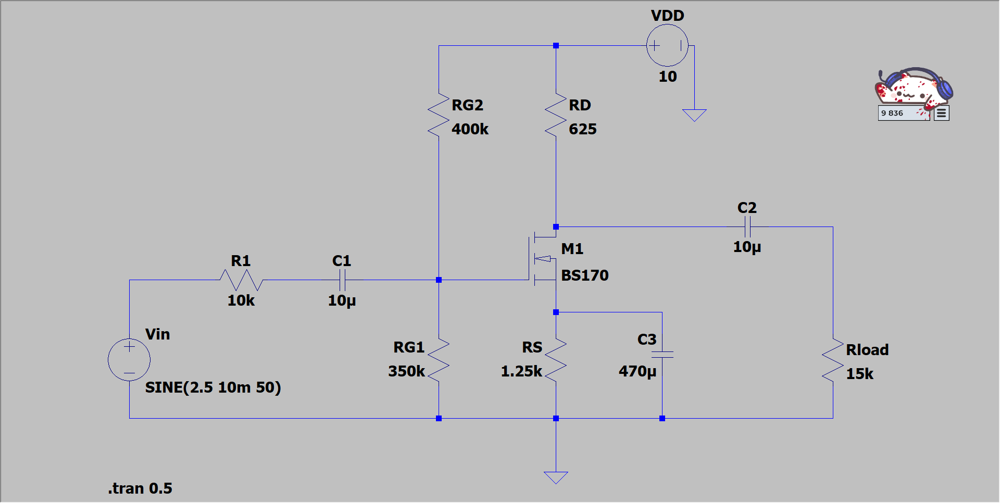

# 任务
使用 **BS170** 设计一个将输入电压放大12倍，$V_{DD} = 10V$ 的功率放大器

# 步骤
我们需要确定元件参数

## 第一步
首先确定漏极电流$I_D$:  
由于增益$A_V = g_m(R_D||R_L)$,  
$g_m = \frac{2I_D}{V_{GS} - V_t}$ 
实验测得$V_t=2.15V$，$V_{GS} = 2.35V$ 
由于$A_V$正比于${I_D, I_D}$过大时$R_D$需要一个较小的值，难以调控，故选择较小的${I_D = 2mA}$ 
## 第二步
为了使MOSFET工作在饱和区，$V_{GS}$ 必须大于 $V_t$ 
不妨假设$V_S = 2.5V$ 
则此时$V_G = V_S + V_{GS} = 4.65V$ 
同时由于$I_S = I_D$，我们可以得到$R_S = \frac{V_S}{I_D} = 1.25kΩ$ 
## 第三步
现在让我们确定$R_{G1}$和$R_{G2}$ 
与交流信号相比，栅极的直流分量必须很小，所以$R_{G1}$和$R_{G2}$需要是大电阻。不妨假设$R_{G1} = 400kΩ$ 
由于对于$V_{DD}$而言$R_{G1}$和$R_{G2}$串联，可以计算出$R_{G2} = \frac {R_{G1} }{V_{DD} - V_G} \times V_G = 347.7kΩ$ 
## 第四步
接下来让我们计算$R_D$ 
我们已经可以计算$g_m = 20mS$，将$A_V = 12$代入，解的$R_D = 0.625kΩ$ 
## 第五步
补充剩下的电路 
$C_1$和$C_2$都是隔直电容，将其设为$10\mu C$即可 
$C_3$为旁路电容，容抗$X = \frac{1}{2\pi fC}$ 
为了使增益不受影响，$X$应远小于$R_S$，故最终选择$C_3 = 470\mu C$ 
出于保护电路考虑，选择$R_1 = 10kΩ$
# 结果
