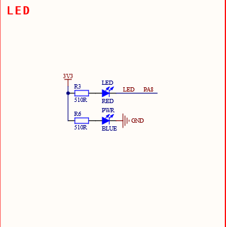

# 前言
反正以后做毕设的时候也要学，不如现在学...<br>
依然只记录老师不教的内容
# 记录
## 在VSCode中烧录KeilV5以上版本的程序
在扩展商店里面安装Keil Assistant扩展，然后在设置里面设置Keil路径即可
## 选择GPIO的方式
江协科技的视频里面，点亮板子自带的LED需要C13端口<br>
但很显然我贪便宜，买了正点原子的<br>
查阅资料表明，这块最小系统板的LED是A8端口<br>

所以代码改成
```c
RCC_APB2PeriphClockCmd(RCC_APB2Periph_GPIOA, ENABLE);// 开启总线时钟
GPIO_InitTypeDef GPIO_InitStructure;
GPIO_InitStructure.GPIO_Mode = GPIO_Mode_Out_PP;// 标准推挽输出（那么问题来了，什么是推挽输出）
GPIO_InitStructure.GPIO_Pin = GPIO_Pin_8;// 选择引脚8
GPIO_InitStructure.GPIO_Speed = GPIO_Speed_50MHz;// 选择速度50MHz（为什么要选择50MHz）
GPIO_Init(GPIOA, &GPIO_InitStructure);// 初始化GPIOA的引脚8
GPIO_SetBits(GPIOA, GPIO_Pin_8);// 点亮LED
//GPIO_ResetBits(GPIOA, GPIO_Pin_8); // 熄灭LED
```
## 什么是推挽输出？
必应了一下，看不懂<br>
本着不懂原理也能用的精神，这个问题转化为了“为什么要用推挽输出”
## 为什么要用推挽输出？
我们需要输出电流驱动LED负载，只有推挽输出能做到。开漏输出需要上拉电阻到VDD
## 为什么选择速度50MHz？
首先，GPIO_Speed说明了这个GPIO口信号最高翻转频率<br>
这个数值越高，信号的上升沿和下降沿时间就越短，波形更接近方波<br>
当然我们只是控制一个LED，2MHz完全够用<br>
那么就引出了下一个问题
## 如何选择合适的速度？
从波形角度来看，速度越高越好。<br>
但是高速信号有几个问题。首先是能耗高，其次是信号边沿可能发生振铃，造成误判（振铃是指上升沿过冲，比方说最大输出电压是3.3V，过冲的时候输出变为3.9V；以及下降沿下冲，比方说低电平本来是0，下冲的时候输出变为负值了）甚至损坏IO口或电路，最后是电磁干扰（EMI）高频信号可能会干扰其它电路<br>
所以对于普通输入输出或者长走线我们一般只需要2MHz或者10MHz<br>
## 流水灯踩坑记录
GPIO_Init那些东西太麻烦了，对于每一个引脚都要执行相同的操作，咱要把逻辑抽离出来，写成函数（智将）<br>
咱真是面向对象高手啊
```c
GPIO_InitTypeDef registPin(GPIOMode_TypeDef mode, GPIOSpeed_TypeDef speed, const char* pinName)
{
	GPIO_InitTypeDef GPIO_InitStructure;
	GPIO_InitStructure.GPIO_Mode = mode;
	GPIO_InitStructure.GPIO_Speed = speed;
	GPIO_InitStructure.GPIO_Pin = 1 << atoi(pinName + 1);
	switch (pinName[0])
	{
		case 'A':
			RCC_APB2PeriphClockCmd(RCC_APB2Periph_GPIOA, ENABLE);
			GPIO_Init(GPIOA, &GPIO_InitStructure);
			break;
		case 'B':
			RCC_APB2PeriphClockCmd(RCC_APB2Periph_GPIOB, ENABLE);
			GPIO_Init(GPIOB, &GPIO_InitStructure);
			break;
		case 'C':
			RCC_APB2PeriphClockCmd(RCC_APB2Periph_GPIOC, ENABLE);
			GPIO_Init(GPIOC, &GPIO_InitStructure);
			break;
		case 'D':
			RCC_APB2PeriphClockCmd(RCC_APB2Periph_GPIOD, ENABLE);
			GPIO_Init(GPIOD, &GPIO_InitStructure);
			break;
		case 'E':
			RCC_APB2PeriphClockCmd(RCC_APB2Periph_GPIOE, ENABLE);
			GPIO_Init(GPIOE, &GPIO_InitStructure);
			break;
		default:
			break;
	}

	return GPIO_InitStructure;
}
```
然后继续看视频<br>
诶我去怎么还能按位与的<br>
```c
GPIO_InitTypeDef GPIO_InitStructure;
RCC_APB2PeriphClockCmd(RCC_APB2Periph_GPIOA, ENABLE);
GPIO_InitStructure.GPIO_Pin = GPIO_Pin_4 | GPIO_Pin_5 | GPIO_Pin_6 | GPIO_Pin_7;
GPIO_InitStructure.GPIO_Mode = GPIO_Mode_Out_PP;
GPIO_InitStructure.GPIO_Speed = GPIO_Speed_2MHz;
GPIO_Init(GPIOA, &GPIO_InitStructure);
```
解决