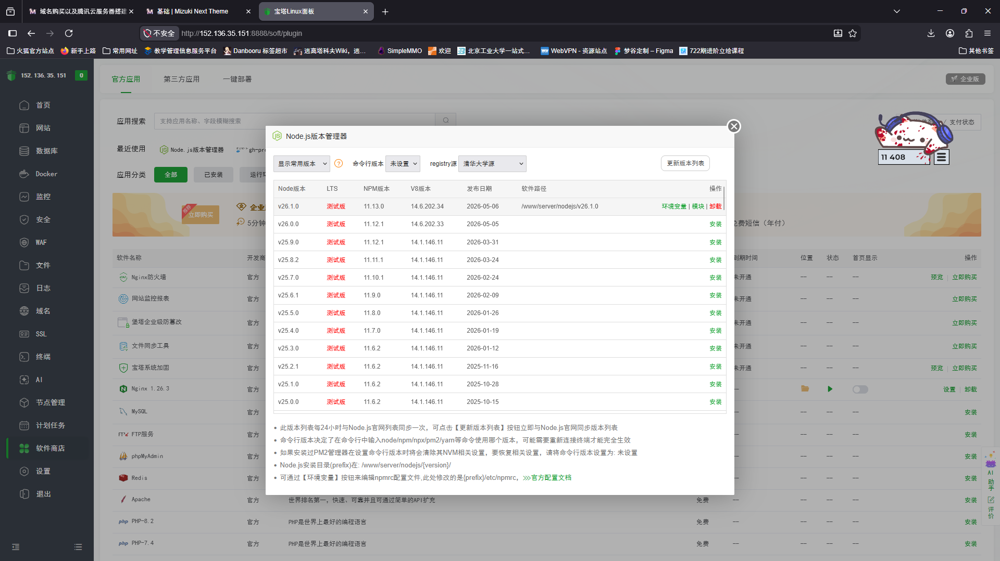
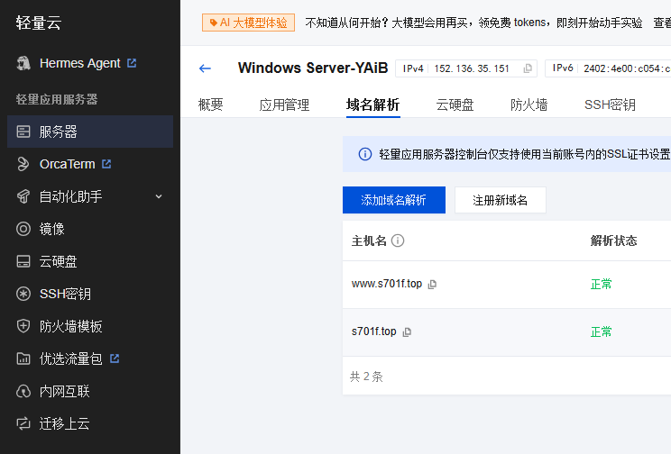
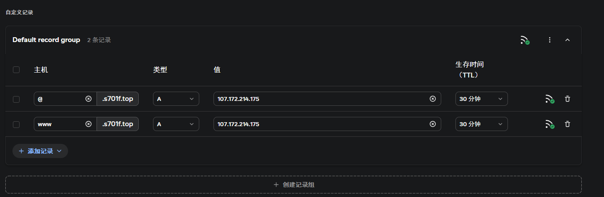
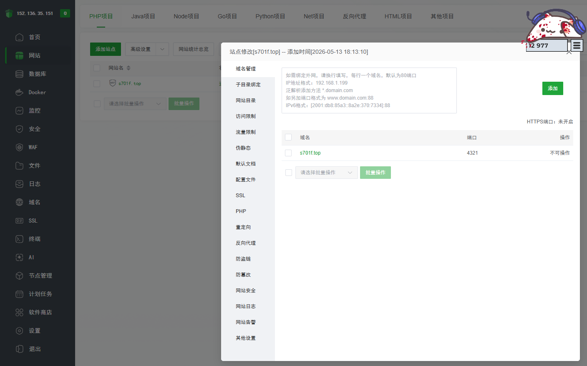
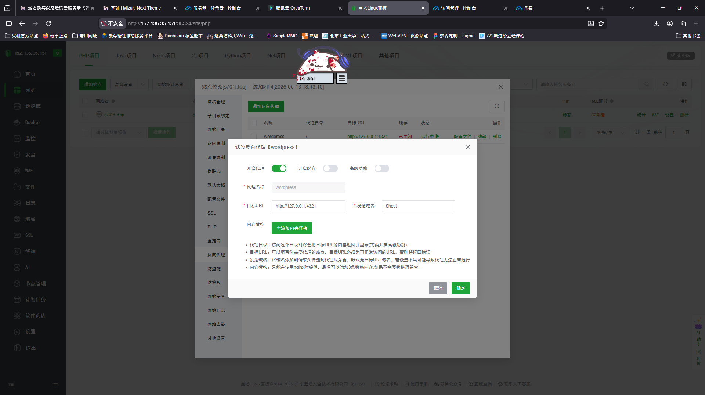

# 前言
既然已经开始写博客了，咱总得把它部署到服务器上对吧。抱着这样的想法买了个域名<br>

# 域名购买
咱是在 [spaceship](https://www.spaceship.com/zh/ "spaceship") 上面买的，货比三家之后发现这家买.top域名是最便宜的<br>
最后花了八块钱买了 s701f.top 这个域名。说实话八块钱买到五个字母的域名还是很赚的

# 服务器租赁
接下来是租服务器，本着省钱的思想问了群友。言子的推荐是racknerd，但我注册账号的时候验证码加载不出来，挂了梯子也一样<br>
遂把目光投向国内，Alumopper姐姐推荐腾讯云...但是怎么最便宜的也要500一年啊<br>
突然想起咱是学生，可以用学生优惠，于是获得了78块钱一年的试用期<br>

# 搭建环境
由于咱是笨蛋不会linux命令行，首先需要安装面板。国内的话是有两个面板，一个是宝塔一个是1Panel<br>
可能是嫌弃宝塔这个名字太俗了，咱先选了1Panel，然后发现看不懂教程不会安装nodejs，遂重装系统<br>
接下来换成宝塔。mizuki的教程说要从应用商店下载nginx，nodejs和pm2。nginx好说，在网站那一栏直接安装就行，但是nodejs安装的时候出了很多问题<br>
首先教程里面说的比较模糊，实际上应该在应用商店里面搜索nodejs管理器，然后选择一个有最新版本nodejs的镜像源（别用默认的，那个只到2021年，咱一开始选的这个，走了好多弯路）<br>
<br>
然后到终端里面，运行`npm install -g pnpm`把pnpm下下来（这个框架的包管理器是pnpm）<br>
啊这，终端说它找不到npm<br>
赶快看看nodejs在不在，输入`nodejs -v`<br>
啊这，终端说它也找不到nodejs<br>
那么问题来了，咱之前确实下载了nodejs啊，问题出在哪里呢？<br>
原来是环境变量没添加，执行
```
echo 'export PATH="（你的nodejs路径）:$PATH"' >> ~/.bashrc
source ~/.bashrc
```
即可<br>

# 部署网页代码
首先咱把网页传到github上面，这样可以直接在服务器端拉取远端代码<br>
然后咱在O滨兴的长城上撞了个头破血流，github下载不下来<br>
由于这是腾讯云，咱不能下载vpn<br>
所以只能本地打包，然后上传到服务器端<del>流量-1GB</del><br>
之后和教程里说的一样，运行
```
pnpm install #安装依赖包
pnpm build #构建网站
```
就行了

# 设置域名
现在咱的网页可以访问了，但只能通过ip地址+端口号的形式<br>
为了成为一个正常的网页，我们需要设置域名<br>
首先在腾讯云界面设置域名解析

然后回到[spaceship](https://www.spaceship.com/zh/ "spaceship")，进入[高级DNS](https://www.spaceship.com/zh/application/advanced-dns-application/manage/ "高级DNS")，点击创建自定义预设并添加腾讯云给你的记录<br>

进入宝塔面板，选择网站，点击添加站点，根目录选择/dist<br>
然后去域名管理，添加你的域名和端口号<br>

现在我们可以用域名加端口号的形式访问了<br>
<del>我去怎么要备案</del>

# 设置反向代理
点击反向代理，然后按照图中内容填写，理论上讲成功之后就可以直接域名访问了<br>
<br>
感谢Alumopper姐姐的倾力支援<br>