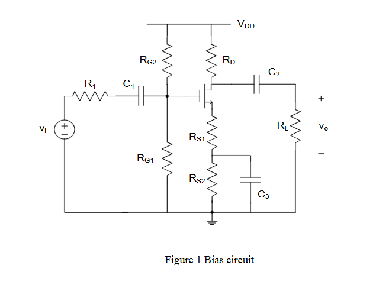
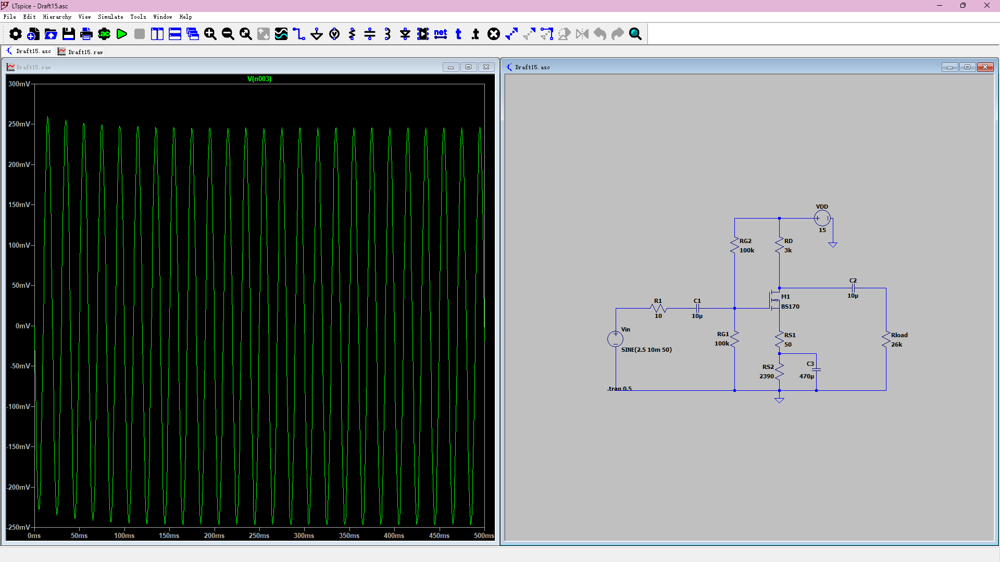

# 任务
依然是使用**BS170**进行设计，这次要求$V_{DD} = 15V$，$R_L = 26k$，$A_V = 27$
# 步骤
还是需要先确定元件参数

## 第一步
按照[上一次实验](../MOSFET功放设计记录/ "上一次实验")的流程，我们搭建一个相同的电路 
什么？你问$R_{S1}$和$R_{S2}$是什么东西？<del>咱不知道啊，把它当成源极电阻吧，只需要两个加一起等于算出来的$R_S$就行</del> 
什么？你问$I_D$该怎么选择？<del>为了装作咱真的掌握了MOS管相关内容，一定要和之前选的不一样啊，那就4mA吧</del>
于是在$V_{GS} = 7.5V, R_{G1} = R_{G2} = 100k, I_D = 4mA$的情况下完成了电路设计 
我超$A_V$怎么等于0.2，大失败
## 错误分析
问题出在哪里呢？原因在于先前的实验中交流信号可以直接走电容，不会被$R_S$影响。但现在的设计中交流信号依然要走$R_{S1}$ 
那么问题来了，真实的增益公式是什么呢？ 
当然是$A_V = \frac{g_m(R_D//R_L)}{1 + g_mR_{S1} }$啦 
让我们重新计算，然后仿真 
我超，怎么$V_o$只有几$\mu V$了，还是大失败 
## 错误分析2
这次的错误是什么呢？答案在我们之前选取的$R{S1}$上。 
由公式可得，$R_{S1}$越大，$R_D//R_L$就越大。由于$R_L$为定值，那么只能增大$R_D$ 
这就是问题的原因，$V_D = I_DR_D$，我们的$R_{S1} = 390$，这时$R_D≈22k$，对应的分压$V_D = 88V$，而我们的$V_{DD}$只有可怜的15V，导致漏极电压为负 
## 结果
让我们重新计算，增加$R_D$的约束条件。顺便把$I_D$降到2mA以降低$R_S$ 
因为$V_D > V_S + 0.5V$(这个0.5V是工程常数) 
又因为我们选取的$V_S = 5.15V$，故$V_D > 5.65V$（这个条件下$R_{G1} = R_{G2}$，分压都是7.5V） 
这样可以得到$R_D < \frac{V_{DD} - V_D}{I_D} = 4675$ 
我们选择一个小一点的$R_{S1} = 50$，这时$R_{S2} = 2390$，解得$R_D = 3009$，符合条件 
设计完成
