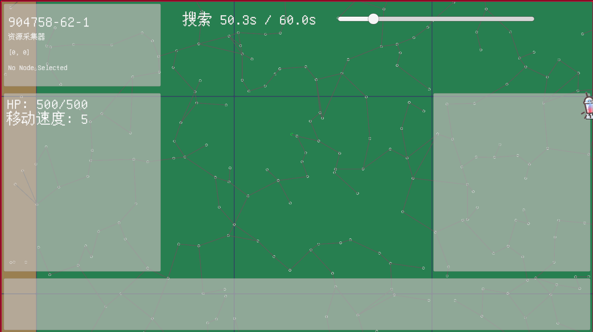

# 前言
最近在倒腾自己的独游，在生成世界的时候遇到了问题<br>
就像《群星》的超空间网络那样，咱希望生成连接空间上临近的点的道路网。但与群星的有限世界不同，在咱的游戏里，道路会无限延伸下去<br>
为了有序地生成世界，咱将世界划分为多个区块，区块内部又划分为16*16共256个小方格。大部分小方格内部是空的，但是一小部分小方格内部有被称为“资源点”的节点。<br>
由于这是一个无限世界，一次性生成所有区块在图灵机上不太可能，所以咱采用了MC的思想：将区块分为未加载，弱加载和强加载。强加载区块是玩家及其队友所在区块以及周围的八个区块组成的集合；弱加载区块是落在友军5×5加载窗口内、但不在3×3内的区块，只保留节点数据、NPC的状态机挂起；曾经加载过又离开的区块属于冻结档，数据长驻、NPC状态机销毁。<br>
咱的需求是：<br>
1. 对于相同的种子，相同的位置，路网的生成相同
2. 路网的生成与区块加载顺序无关
3. 道路不允许交叉
4. 每一个节点都需要连接到路网中
5. 道路尽可能短
<br>
那么，开始设计我们的算法吧

# 设计
区块是咱游戏世界的最小加载单元，那么路网理应以区块为单位生成<br>
所以我们的算法至少应该分为两个步骤：
1. 生成区块内部路网
2. 连接跨区边

## 区块内部路网生成
在咱的设计中，一个区块平均有45个左右的节点。那么仅仅是区块内部，就可以连接出$C_{45}^2 = 990$条边，这些边几乎都是交叉的。直接修改这张图，我们不太可能在短时间内得到一个符合我们要求的路网<br>
所以我们需要进行一些优化操作...<br>
### Delaunay 三角剖分与Bowyer-Watson算法
三角剖分天然适合咱的需求。通过把这张图划分为多个三角形，我们可以满足需求3——道路不允许交叉和需求4——每一个节点都需要连接到路网中（至少在区块内部如此）<br>
但是三角剖分有很多种不同形式。为了满足需求5——道路尽可能短，我们可以选择一种特殊的三角剖分：Delaunay三角剖分。它提供的是一张"无交叉且偏向短边"的候选边池。有关这个的具体定义，本站已经与百度、必应、谷歌等互联网公司达成深度合作协议，可以使用它们的搜索引擎搜索。我们需要利用的只有它的一个性质：
```
    Delaunay三角剖分其实并不是一种算法，它只是给出了一个“好的”三角网格的定义，它的优秀特性是空圆特性和最大化最小角特性：在所有可能的三角剖分中，Delaunay剖分的最小角是最大的，这抑制了过于狭长的三角形，也使得Delaunay三角剖分应用广泛。
    空圆特性是指剖分中任意一个三角形的外接圆内，都不能包含点集中的任何其他点（“两个共边三角形互不包含对方顶点”只是它的局部情形），这种形式的剖分产生的最小角最大。
```

生成Delaunay三角剖分可以使用Bowyer-Watson算法，其思想是首先创建一个覆盖所有点的超级三角形，然后不断地加入新点拆解覆盖新点的三角形，最后移除与超级三角形相关的所有三角形

那么我们来看看具体实现
```csharp
private class Triangle
{
    public Vector2 A;
    public Vector2 B;
    public Vector2 C;
    public Triangle(Vector2 a, Vector2 b, Vector2 c)
    {
        A = a;
        B = b;
        C = c;
    }
    /// <summary>
    /// 计算三角形的外心坐标与外接圆半径
    /// </summary>
    /// <returns></returns>
    public Vector2 Circumcenter()
    {
        float D = 2 * (A.x * (B.y - C.y) + B.x * (C.y - A.y) + C.x * (A.y - B.y));
        float Ux = ((A.x * A.x + A.y * A.y) * (B.y - C.y) + (B.x * B.x + B.y * B.y) * (C.y - A.y) + (C.x * C.x + C.y * C.y) * (A.y - B.y)) / D;
        float Uy = ((A.x * A.x + A.y * A.y) * (C.x - B.x) + (B.x * B.x + B.y * B.y) * (A.x - C.x) + (C.x * C.x + C.y * C.y) * (B.x - A.x)) / D;
        if(Mathf.Abs(D) < Mathf.Epsilon)
        {
            return new Vector2(float.NaN, float.NaN); // 外心不存在，返回NaN
        }
        return new Vector2(Ux, Uy);
    }
    /// <summary>
    /// 判断点是否在三角形内部
    /// 判断方法是计算PAB、PBC、PCA三个小三角形的面积之和是否等于ABC三角形的面积
    /// 这算法也太力大砖飞了（
    /// </summary>
    /// <param name="point">待判断的点</param>
    /// <returns></returns>
    public bool IsContain(Vector2 point)
    {
        float areaABC = Mathf.Abs((A.x * (B.y - C.y) + B.x * (C.y - A.y) + C.x * (A.y - B.y)) / 2);
        float areaPAB = Mathf.Abs((point.x * (A.y - B.y) + A.x * (B.y - point.y) + B.x * (point.y - A.y)) / 2);
        float areaPBC = Mathf.Abs((point.x * (B.y - C.y) + B.x * (C.y - point.y) + C.x * (point.y - B.y)) / 2);
        float areaPCA = Mathf.Abs((point.x * (C.y - A.y) + C.x * (A.y - point.y) + A.x * (point.y - C.y)) / 2);
        return Mathf.Approximately(areaABC, areaPAB + areaPBC + areaPCA);
    }
}
```

这是三角形的定义，附带了外心坐标的计算方法和判断点是否在三角形内部的方法。~~外心坐标计算是我从网上抄的，并不会推导~~

```csharp
int minX = int.MaxValue, maxX = int.MinValue, minY = int.MaxValue, maxY = int.MinValue;
foreach (var p in nodePositions)
{
    if (p.x < minX) minX = p.x;
    if (p.x > maxX) maxX = p.x;
    if (p.y < minY) minY = p.y;
    if (p.y > maxY) maxY = p.y;
}
float centerX = (minX+ maxX) * 0.5f;
float centerY = (minY+ maxY) * 0.5f;
float span = Mathf.Max(maxX - minX, maxY - minY);
float R = span * 2f +1f;
Vector2 SuperTriPos1 =new Vector2(centerX -2f * R, centerY - R);
Vector2 SuperTriPos2 =new Vector2(centerX +2f * R, centerY - R);
Vector2 SuperTriPos3 =new Vector2(centerX,centerY + 2f * R);
Triangle superTriangle = new Triangle(SuperTriPos1, SuperTriPos2, SuperTriPos3);
```
首先我们计算超级三角形的坐标。注意这里的坐标不能随便写一个超大的数，否则会因为float精度问题导致一部分点没法加入三角剖分<br>
比较好的思路是找出所有点的$X_{max}, X_{min}, Y_{max}, Y_{min}$，用这四个坐标计算超级三角形，保证其恰好覆盖所有点且不太大（注意计算R的时候要+1f，这是为了当所有点共线甚至重合时span=0，+1能保证超级三角形保底非退化、严格包住全部点）

```csharp
List<Triangle> triangles = new List<Triangle> { superTriangle };// 三角形集合
List<Triangle> badTriangles = new List<Triangle>();// 坏三角形
```
我们创建两个集合，一个是目前的三角剖分，另一个是加入点后形成的坏三角形

```csharp
foreach (Vector2Int nodePos in nodePositions)
{
    badTriangles.Clear();
    foreach (Triangle triangle in triangles)
    {
        Vector2 circumcenter = triangle.Circumcenter();
        if(float.IsNaN(circumcenter.x) || float.IsNaN(circumcenter.y))
        {
            continue; // 外心不存在，跳过该三角形
        }
        // 平方距离比较（免开方误差）；用 <= 让严格共圆的点也判坏，避免点被漏插
        float circumradius = Vector2.SqrMagnitude(circumcenter - triangle.A);
        if (Vector2.SqrMagnitude(circumcenter - (Vector2)nodePos) <= circumradius)
        {
            badTriangles.Add(triangle);
        }
    }
    // 找到坏三角形的边界
    HashSet<(Vector2, Vector2)> polygon = new HashSet<(Vector2, Vector2)>();
    foreach (Triangle bad in badTriangles)
    {
        (Vector2, Vector2)[] es = { (bad.A, bad.B), (bad.B, bad.C), (bad.C, bad.A) };
        for(int i = 0;i < es.Length; i++)
        {
            if(es[i].Item1.x > es[i].Item2.x || (es[i].Item1.x == es[i].Item2.x && es[i].Item1.y > es[i].Item2.y))
            {
                es[i] = (es[i].Item2, es[i].Item1);
            }
        }
        foreach(var edge in es)
        {
            if(!polygon.Add(edge))
            {
                polygon.Remove(edge);
            }// 三角形的边只可能出现一次或两次，出现两次说明是内部边界，应该被移除
        }
    }
    // 移除坏三角形
    foreach (var bad in badTriangles)
    {
        triangles.Remove(bad);
    }
    // 用新点连接边界形成新三角形
    foreach ((Vector2 p1, Vector2 p2) in polygon)
    {
        triangles.Add(new Triangle(p1, p2, nodePos));
    }
}
```
我们依次插入点集中的点<br>
对于每一次插入，我们把外接圆包含该点的三角形加入坏三角形集合，然后获取所有坏三角形组成集合的外边界（这里可以使用HashSet加速，三角剖分中，一条边只可能属于一个三角形或两个三角形，前者是外边界，后者是内部边），最后移除所有坏三角形并连接新点和外边界的顶点<br>

```csharp
// 移除超级三角形的影响
triangles.RemoveAll(t => t.A == SuperTriPos1 || t.B == SuperTriPos1 || t.C == SuperTriPos1 ||
                         t.A == SuperTriPos2 || t.B == SuperTriPos2 || t.C == SuperTriPos2 ||
                         t.A == SuperTriPos3 || t.B == SuperTriPos3 || t.C == SuperTriPos3);
// 移除外心不存在的三角形（三点共线）
triangles.RemoveAll(t => float.IsNaN(t.Circumcenter().x) || float.IsNaN(t.Circumcenter().y));
```
完成这些之后，我们删除所有以超级三角形某一（些）顶点为顶点的三角形，并且移除三点共线的退化三角形（这个三角形的外心计算不出来）<br>
现在我们有了最基本的路网。此后路网的增减都是基于这个初始路网。

### 使用最小生成树稀疏化区块内部路网
接下来，咱希望控制路网的密度，让路网看起来比较有层次感<br>
由于我们需要一个连通图，所以边数最少时这张图应该是一个生成树，为了满足需求5，我们可以跑一遍[Kruskal最小生成树](./../kruskal最小生成树/index.md)，然后按照比例，从小到大回填一定数量的冗余边。完成<br>
~~你应该学习最小生成树的一个理由~~

### 跨区边生成
咱发现咱设计的区块生成算法有一个特点，就是区块的种子由世界种子和区块的坐标计算而成，是一个定值，也就是说，区块内节点排布与区块的加载顺序无关<br>
那么我们可以提前弱加载周围的区块，并设计一种具有对称性的算法，连接一定数量的跨区边<br>

### 跨区边算法
对于周围每一个弱加载的区块，从i = 3开始，获取区块边界两侧各i行（列）中所有节点，每一侧的节点组成一个点集（注意要排除距区块角部不足i格的节点，否则上下与左右两个方向的跨区边会在角部不可避免地相交）。从两个点集中各取一个元素，两点连成的线段加入线集合，从线集中选取前k条长度最小且相互不相交（也要与两侧内部道路不相交）的线段加入跨区块路网。如果选择数量不足，则进行迭代加深操作，i+=2，到i = 7强制结束。若i = 7时仍然一条都选不出来，就退而求其次连一条最短的线段（即使它交叉），因为保连通比局部无交叉更重要<br>
这个算法的对称性其实是三个细节共同保证的：其一，排序键必须使用规范化后的无向边（按世界坐标字典序排列两端点），不能以"本侧端点优先"排序，否则A视角和B视角排出的顺序不同；其二，配额k要取双方节点数与稀疏比例的较小值，保证双方算出同一个k；其三，障碍线段集合由两侧内部道路共同构成。三者齐备后，不论先加载哪一边的区块，跨区边都是固定的<br>
现在的问题在于k值怎么算<br>
我们假设n = 每区块节点数（45），r = 实际保留比例，λ = 每单位面积节点数（45/256 = 0.176）<br>
我的点集取样近似于一个泊松点过程（严格来说是"每格至多一个点"的随机排斥放置，泊松是它的连续空间近似），根据Miles 1970的经典结果，泊松点过程Delaunay剖分的边数密度（即单位面积中的边数） = 3λ<br>
同一理论给出平均边长 ≈ 1.41/√(πλ) ≈ 0.795/√λ<br>
概统知识告诉我，方向 θ 在 [0,π) 均匀分布时 ∫|cosθ| dθ 的均值 = 2/π<br>
体视学的经典公式（Santaló 1976；Stoyan, Kendall, Mecke 1995）告诉我，各向同性随机线段系，单位长度测试线上的平均交点密度 = 边数密度 × 平均边长 × E|cosθ| = 3λ × (0.795/√λ) × (2/π) ≈ 1.52√λ<br>
乘以边界长度 L，并把 λ = n/L² 代入：<br>
$N = 1.52L \times \sqrt{n/L^2} = 1.52 \sqrt{n}$

```csharp
// 每方向配额：经验公式（与区块大小无关，只依赖节点数与保留比例）；取双方较小值保证对称
float nA = chunk.Nodes.Count, nB = neighbor.Nodes.Count;
float ratioA2 = selfDelaunayEdgeCount > 0 ? selfInternalEdges.Count / (float)selfDelaunayEdgeCount : 0f;
float ratioB = neighborDelaunayCount > 0 ? neighborInternalEdges.Count / (float)neighborDelaunayCount : 0f;
float ratio = Mathf.Min(ratioA2, ratioB);
int quota = Mathf.Max(1, Mathf.RoundToInt(CrossChunkQuotaK * Mathf.Sqrt(Mathf.Min(nA, nB)) * ratio));
```

```csharp
// 相交检测的障碍线段集合（世界坐标）：双方内部道路 + 已选跨区块道路
var blocked = new List<(Vector2Int a, Vector2Int b)>();
foreach (var (u, v) in selfInternalEdges)
{
    blocked.Add((chunkPos * grid + u, chunkPos * grid + v));
}
foreach (var (u, v) in neighborInternalEdges)
{
    blocked.Add((neighborPos * grid + u, neighborPos * grid + v));
}
```
将所有内部边加入障碍线段集合

```csharp
for (int i = CrossChunkBandStart; i <= CrossChunkBandEnd && selected.Count < quota; i += 2)
{
    var candSelf = GetBorderCandidates(selfPositions, dir, i);
    var candOther = GetBorderCandidates(otherPositions, -dir, i);
    // 两侧候选两两连线段，按长度升序。
    // 排序键使用规范化后的无向边（世界坐标字典序）：保证从任一区块视角生成的结果一致
    // （若以"本侧端点"为主键，则 A 生成与 B 生成的结果可能不同，破坏加载顺序无关性）。
    var candidates = new List<(Vector2Int a, Vector2Int b, long len)>();
    foreach (var a in candSelf)
    {
        foreach (var b in candOther)
        {
            Vector2Int ga = chunkPos * grid + a;
            Vector2Int gb = neighborPos * grid + b;
            long dx = ga.x - gb.x, dy = ga.y - gb.y;
            candidates.Add((ga, gb, dx * dx + dy * dy));
        }
    }
    if (candidates.Count == 0) continue;
    candidates.Sort((x, y) =>
    {
        if (x.len != y.len) return x.len.CompareTo(y.len);
        var e1 = NormalizeGlobal(x.a, x.b);
        var e2 = NormalizeGlobal(y.a, y.b);
        int cmp = CompareGlobal(e1.Item1, e2.Item1);
        if (cmp != 0) return cmp;
        return CompareGlobal(e1.Item2, e2.Item2);
    });
    foreach (var cand in candidates)
    {
        if (selected.Count >= quota) break;
        if (!IsBlocked(cand.a, cand.b, blocked, selected))
        {
            selected.Add((cand.a, cand.b));
        }
        else if (cand.len < fallbackLen)
        {
            fallbackLen = cand.len;
            fallback = (cand.a, cand.b);
        }
    }
}
```
构造跨区边集合，自小到大排列，每次连接检测是否与之前连接的线段交叉
```csharp
/// <summary>
/// 线段相交判定（共享端点不算相交；共线重叠算相交）。
/// </summary>
private static bool SegmentsIntersectProperly(Vector2Int a, Vector2Int b, Vector2Int c, Vector2Int d)
{
    if (a == c || a == d || b == c || b == d) return false; // 共享端点：分叉合法
    long o1 = Orient(a, b, c);
    long o2 = Orient(a, b, d);
    long o3 = Orient(c, d, a);
    long o4 = Orient(c, d, b);
    if (o1 == 0 && OnSegment(a, b, c)) return true;
    if (o2 == 0 && OnSegment(a, b, d)) return true;
    if (o3 == 0 && OnSegment(c, d, a)) return true;
    if (o4 == 0 && OnSegment(c, d, b)) return true;
    return (o1 > 0) != (o2 > 0) && (o3 > 0) != (o4 > 0);
}
```
判断线段是否相交的算法

